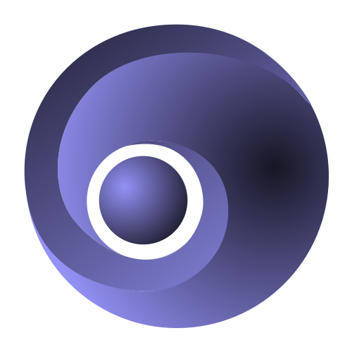

# Ogone

[](https://github.com/SRNV/Ogone/stargazers)
[](https://github.com/SRNV/Ogone/issues)
[](https://github.com/SRNV/Ogone/forks)
[](https://github.com/SRNV/Ogone)

---

# Description

use Ogone to compile web-components for your applications. it's based on Deno.
Actually Ogone is under an experimental phase. avoid using it for production.
Ogone has it own extension `*.o3` which allow some new features.
No Proxies, no getters, no setters used for the reactivity, just code...

---

# Installation

```typescript
import o3 from 'https://raw.githubusercontent.com/SRNV/Ogone/master/mod.ts';
...
o3.run({
  entrypoint: 'path/to/root-component.o3',
  port: 8080,
});
```

---

# Usage

After the first example, in your root-component.o3, you can make this first greeting app

```typescript
<p>Hello ${name}</p>
<proto>
  def:
    name: SRNV
</proto>
```

let's change the name after 1 second.

```typescript
<p>Hello ${name}</p>
<proto>
  def:
    name: SRNV
  default:
    setTimeout(() => {
      this.name = 'Rudy';
    }, 1000);
  break;
</proto>
```

this will only update the textnode containing 'Hello \${name}' and replace name by it's value.
You certainly recognized the default expression of a switch statement.

### so now what is proto def ?

Making the choice to use only the switch statement to rule the code, includes that the wordings has to be clear enough to understand what is going on.

instead of using script tag, I choosed to use proto tag which is a custom element. the fact is, when we define the Ogone components we are not building a module js. you wont be able to use inside `<proto>` the import statements.
we will see after how to import modules inside your component.

at this point, it means Ogone has to read something that is not conventionnal. It's all new to code component only in a switch statement.

### ok but def ?!

`def` means 'definition' or 'define' (like Python), this custom statement let you define the data of your component.
`def` is the area that only supports YAML language

### output

Ogone will wrap your code into a tiny function which takes 3 arguments.
the state of the component, the context of the function and an event (Event | undefined)

```typescript
(function (_state, ctx, event) {
  switch (_state) {
    ${yourCode}
  }
});
```

### why in a switch statement ?

Switch statement provides an out of the box well structured code. it's globally readable and understood by all.
And Ogone is follwing a minimalistic philosophy. using few options/expressions to structure the code is a good way to make it clear, readable, radically clean.

## Expressions and Custom Expressions

Following this structure of declarations is strongly recommanded:

- def\* (YAML)
- before-each\* (for global declarations)
- case
- default

\*only supported by Ogone

---

# Learn Ogone

to see more stuffs from Ogone, clone this repository

```shell
deno run --allow-all --unstable example/app/index.ts
```

---

# Some examples

### Async component example

[read this documentation on Async Components](https://github.com/SRNV/Ogone/blob/master/src/docs/async.README.md).

```typescript
// require statement tells to the parent component what is needed inside the component.
require id as Number;
// use statement tells to Ogone to use the file as store-component
use @/example/tests/async/reloading/store.o3 as 'store-component';

<store-component namespace="user"/>
<div> Welcome ${user ? user.username : ''}</div>

<proto type="async">
  def:
    user: null
  before-each: // 0.6.0
    const getUser = () => Store.dispatch('user/getUser', this.id)
        .then((user) => {
          this.user = user;
          return user;
        });
  case 'async:update':
    getUser();
  break;
  default:
    getUser().then(user => Async.resolve(user));
</proto>
```

let's see what we can do inside the parent component

```typescript
use @/example/tests/async/reloading/async.o3 as 'async-component';
use @/example/tests/async/reloading/store.o3 as 'store-component';

<store-component namespace="user" />
<async-component :id="id" --await --then:user-loaded />
<proto type="async">
  def:
    id: 1
  case 'then:user-loaded':
    Store.commit('user/USER-IS-LOADED', ctx)
      .then(() => {
        Async.resolve();
      });
    break;
</proto>
```

[for more informations on async components readme](https://github.com/SRNV/Ogone/blob/master/src/docs/async.README.md).

### computed datas

```typescript
<p>Hello ${fullname}</p>
<proto>
  def:
    name: SRNV
    fullname: ''
  before-each:
    const computed = () => this.name + Math.random()
  case 'update:name':
    this.fullname = computed();
  break;
  default:
    setTimeout(() => {
      this.name = 'Rudy';
    }, 1000);
  break;
</proto>
```

### menu component example

```typescript
use @/example/app/stores/menu.store.o3 as 'store-component'
use @/example/app/components/menu/tree-recursive-button.o3 as 'tree-recursive'
use @/example/app/components/logo.o3 as 'logo-el'


<store-component namespace="menu" />
<div class="left-menu"
  --class="{ close: !isOpen }"
  --html="innerHTML">
  <div class="header">
    <logo-el --click:toggle-menu></logo-el>
    <div>0.1.0</div>
  </div>
  <div class="tree">
    <tree-recursive --for="menu as (item)" :item="item">
    </tree-recursive>
  </div>
</div>
<div --class="{ darken: isOpen }" --click:toggle-menu></div>

<proto def="example/app/defs/menu-main.yml">
  def:
    isOpen: false
  case 'click:toggle-menu':
    Store.dispatch('menu/toggle');
  break;
</proto>
```

### recursive component example

```typescript
require item as Object

use @/example/app/components/menu/tree-recursive-button.o3 as 'tree-recursive'
use @/example/app/components/scroll.o3 as 'scroll'


<div class="container">
  <div class="title" --click:toggle --router-go="item.route">
    <span>
     ${item.name}
    </span>
    <span --class="!item.children && item.status ? `status ${item.status}` : ''">
      ${!item.children && item.status ? item.status : ''}
    </span>
    <span --if="item.children && !openTree"> > </span>
    <span --else-if="item.children && openTree"> < </span>
  </div>
  <div class="child" --if="item.children" --class="{ 'child-open': openTree }">
    <scroll>
      <tree-recursive
        --if="!!item.children"
        --for="item.children as (child)"
        :item="child ? child : {}"></tree-recursive>
    </scroll>
  </div>
</div>
<proto>
  def:
    openTree: false
  case 'click:toggle':
    this.openTree = !this.openTree
  break;
</proto>
```

---

# Format

Ogone is formatted by `deno fmt`

# Support

To support, join the [discord](https://discord.com/channels/710950501398610061/710950501398610064) server or do not hesitate to write issues.

# Todo

(\*) required before publication
(\*\*) required before 1.0.0

- [ ] HMR \*\*
- [ ] Imports modules \*
- [ ] Complete Async Component feature \*\*
- [ ] Integrated Ogone-Dev-Tools \*\*
- [ ] Integrated test environment \*\*
  - [ ] case 'test' is supported \*\*
  - [x] stress mode is supported \*\*
- [ ] Controllers Components \*
- [ ] Write robust tests for Ogone \*\*
  - [x] Dom-parser is solid \*\*
  - [ ] Js-this is solid \*\*
  - [x] Scope-css is solid \*\*
- [ ] Switch every files to Typescript \*
  - [ ] Write types \*\*
- [ ] Typescript supported in `<proto>` \*\*
- [ ] Write more exceptions for each features \*\*
- [ ] Write docs \*
- [ ] Write more examples \*\*

# Tests

Ogone implements stress mode. which run the tests each saving you make.
to run the tests:

```shell
deno run --allow-all src/lib/stress/index.ts --stress tests
```
